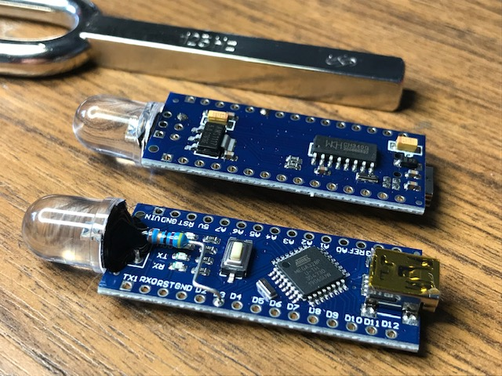
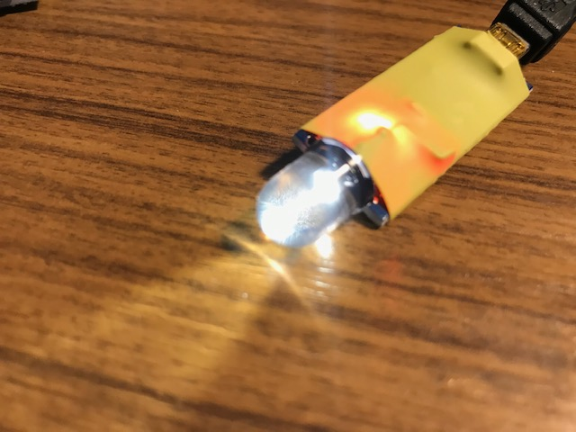
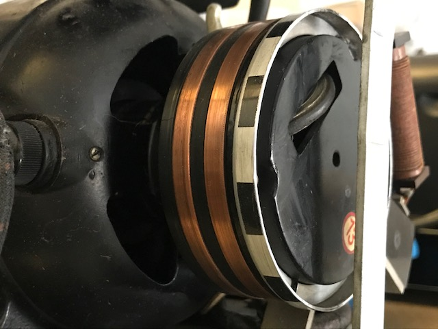
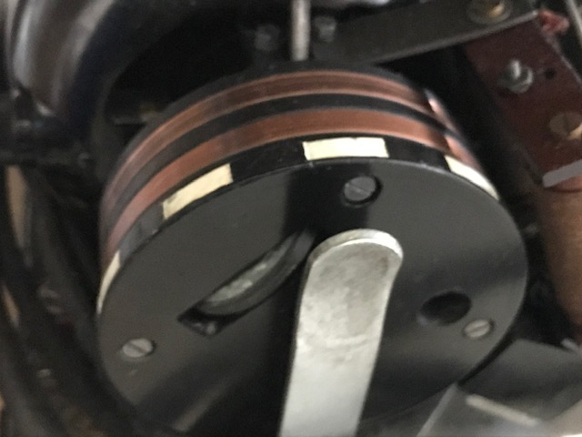
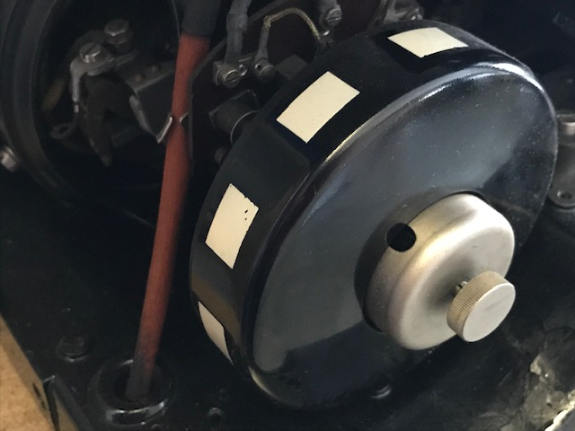
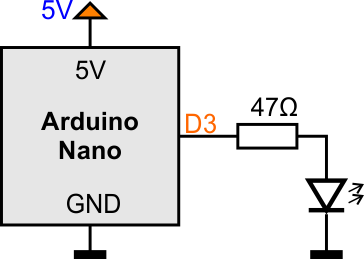
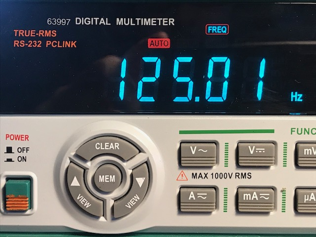
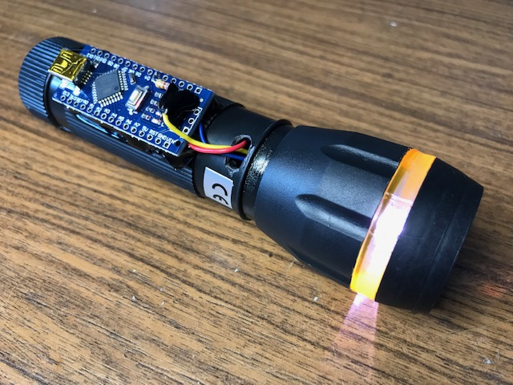
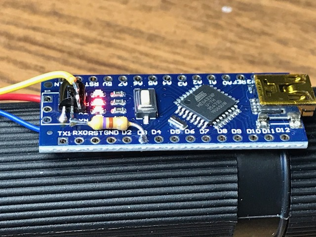
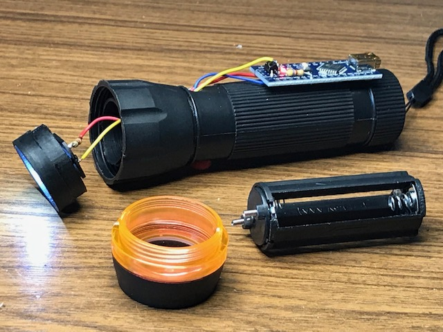

# µC 125Hz Tuning Fork

In the old days, the mechanical __teletype__ devices have a regulated electric motor with stroboscope markings. The motor speed must be well-__trimmed__ to get the correct __baud rate__ for communication. The tuning was done with a mechanical fork with windowed sheets at the end. A technician looks through the fork windows to see the motor marking interfering.

_source: www.theremino.com_

The fork oscillates with __125Hz__ which gives a shuttering frequency of __250Hz__. 

In this project an __Arduino-Nano__-based __stroboscope__ gives pulses with __250Hz__ and 10 % duty cycle to let a __LED__ flicker.

 

# Using this Stroboscope

Mechanical teletypes have black and white markings at the motor axis. These markings are designed to interference with 250Hz (typical 1500rpm and 10 markings).

Dim the room light and lit the markings with the Strobo-LED. If the motor speed is perfectly adjusted, the marking looks to stand still.

  

# Electronic

Designed for an Arduino Nano (or any other Arduino with AVR ATmega328).

Use an ultra-bright white LED and connect it between Arduino pin D3 and GND with a serial resistor of 47 Ohm. The AVR can source up to 40mA per pin.

The LED shows NOT the full light to human eyes because the PWM pulses the LED with a duty cycle of 10%.
Accuracy is adequate.

### Accuracy

Accuracy is adequate.

# Build Examples

### Torch Light

The Arduino Nano is glued on a cheap torch light with three AAA batteries. The battery voltage is between 4.5V and 3V (empty) and fits the spec of the AVR chip. An additional NPN-transistor (BC337) is used to switch the 200mA from the 1Watt LED.

  